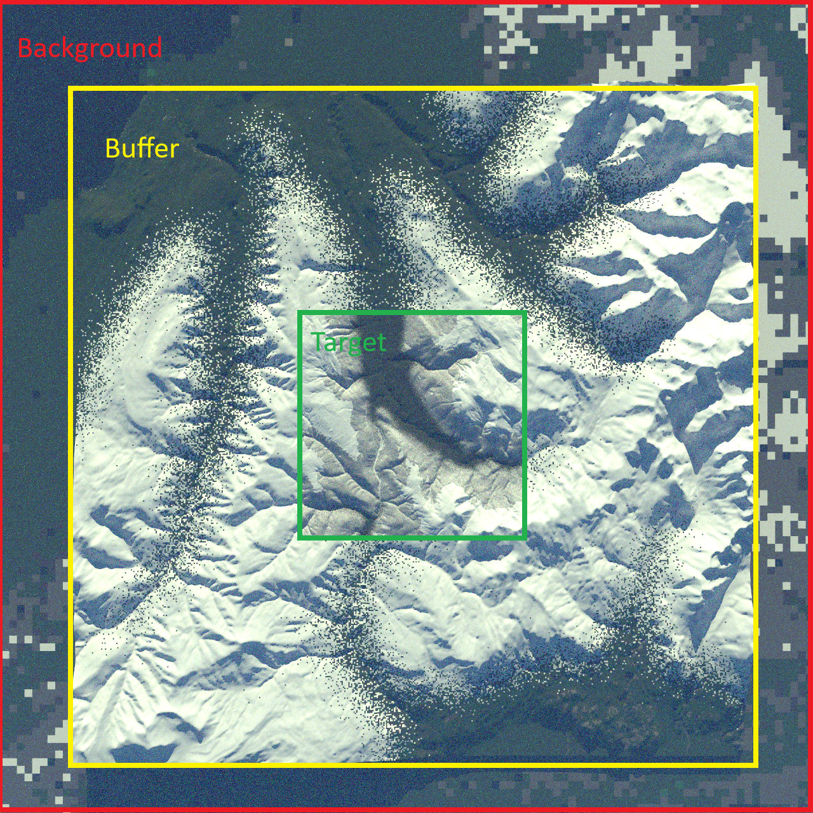

# Concepts

This page explains the key ideas behind scene generation in S2GOS: how scenes are spatially organised, how the generation pipeline works, and how atmosphere is configured.

## Scene Zones

A generated scene is composed of up to three concentric zones, each at a different spatial resolution. Only the **target** zone is required; the buffer and background zones are optional and extend the scene to reduce edge effects.



### Target

The **target zone** is the core area of interest (AOI). It is generated at the highest resolution using full DEM elevation data and landcover-derived material textures and potentially 3D object such as vegetation. All measurements of interest fall within this zone.

The target is defined by a centre coordinate and an AOI size in kilometres (`SceneLocation`).

### Buffer

The **buffer zone** (optional) surrounds the target at a coarser resolution. Its purpose is to reduce adjacency and edge-of-scene artifacts.

Configure via `BufferConfig`:

```python
buffer = BufferConfig(size_km=60.0, resolution_m=100.0)
```

### Background

The **background zone** (optional) is the outermost ring, extending the scene to the horizon. It uses a flat surface at a fixed elevation — no DEM data is used. 

Configure via `BackgroundConfig`:

```python
background = BackgroundConfig(size_km=200.0, resolution_m=200.0, elevation=0.0)
```

## Generation Pipeline

Scene generation follows a multi-step pipeline with automatic dependency resolution via a DAG (directed acyclic graph) executor. The main stages are:

1. **AOI extraction** — Clips DEM and landcover data to the target (and optionally buffer) extent.
2. **Mesh generation** — Converts the DEM into 3D triangle meshes (PLY format), one per zone.
3. **Texture generation** — Maps landcover classes to material definitions, producing texture images for each mesh.
4. **Scene description output** — Writes a `SceneDescription` YAML file that ties meshes, textures, materials, and atmosphere together. This file is the input to the simulator.

Because the pipeline uses DAG-based execution, steps run in the correct order automatically — you only need to provide a `SceneGenConfig` and call `run()`.

### Output directory structure

After generation, the output directory looks like:

```
<output_dir>/<scene_name>/
├── meshes/          # PLY mesh files (target, buffer, background)
├── textures/        # Material texture images
├── data/            # Intermediate data (clipped DEM, landcover)
└── scene.yaml       # SceneDescription file for the simulator
```

## Atmosphere

The atmosphere is defined at generation time and stored in the scene description YAML. It controls how the simulator models scattering and absorption during radiative transfer.

Three atmosphere types are supported:

| Type | Description |
|---|---|
| **Molecular** | Rayleigh scattering + gas absorption. Uses a standard thermophysical profile (e.g. `afgl_1986-us_standard`) or a CAMS NetCDF file. Optionally includes an absorption database. |
| **Homogeneous** | Single spatially-uniform aerosol layer on top of the atmosphere. Defined by an aerosol dataset (e.g. `sixsv-continental`), optical thickness, and scale height. |
| **Heterogeneous** | Combines a molecular background with one or more discrete particle layers, each with its own aerosol type, altitude range, and vertical distribution (exponential, Gaussian, or uniform). |


See the [Atmosphere API reference](api/atmosphere.md) for the full configuration schema and helper functions.
