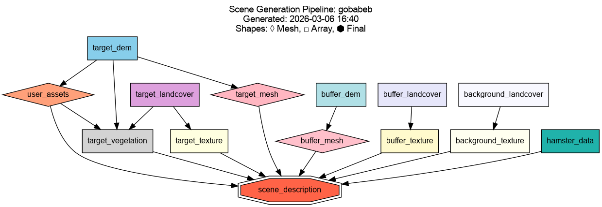

# Concepts

This page explains the key ideas behind scene generation in S2GOS: how scenes are spatially organised, how the generation pipeline works, and how atmosphere is configured.

## Generation Pipeline

Scene generation follows a DAG (directed acyclic graph) pipeline with automatic dependency resolution. Resources are executed in the correct order automatically — you only need to provide a [`SceneGenConfig`][s2gos_generator.core.config.scene.SceneGenConfig] and call `run()`.

The broad stages are:

1. **Data extraction** — Clips source data (DEM, landcover) to the target and optionally buffer/background extents.
2. **Mesh generation** — Converts elevation data into 3D triangle meshes (PLY format), one per zone. The target mesh can be locally refined with an [adaptive quadtree grid](#adaptive-terrain-mesh) so that features such as roads sit on well-resolved, flattened terrain.
3. **Texture generation** — Maps landcover classes to material definitions, producing selection textures for each mesh.
4. **Scene description output** — Assembles all resources into a [`SceneDescription`][s2gos_utils.scene.description.SceneDescription] YAML that ties meshes, textures, materials, and atmosphere together for use by the simulator.

Additional optional resources — [buildings](#buildings), [roads](#roads), [spectral material matching](#spectral-material-matching), vegetation placement, user assets, HAMSTER albedo data, and XML scene imports — are included in the DAG when enabled and run at the appropriate point in the dependency graph.

!!! note 
    The pipeline is under active development. The set of available resources and their configuration options continues to grow.

The pipeline caches completed resources to disk. On subsequent runs, any resource whose configuration is unchanged and whose output files are still present is skipped automatically. Pass `use_cache=False` to [`run()`][s2gos_generator.core.pipeline.SceneGenerationPipeline.run] to force a full rebuild.

Internally the code follows a two-layer split. **Resources** (`resources/`) are the thin DAG nodes: each reads its configuration, calls into the processor layer, persists artifacts, and records them on the shared context. **Processors** (`processors/`) are the pure algorithms and format (de)serialization behind those nodes — fetching and parsing roads, painting textures, matching spectra — free of pipeline state so they can be tested and reused in isolation. The [Processors API reference](api/processors_spectral.md) documents the public functions.

The figure below shows a typical pipeline DAG for a scene with some optional resources enabled:



## Scene Zones

A generated scene is composed of up to three concentric zones, each at a different spatial resolution. Only the **target** zone is required; the buffer and background zones are optional and extend the scene to reduce edge effects.


### Target

The **target zone** is the core area of interest (AOI). It is generated at the highest resolution using full DEM elevation data and landcover-derived material textures and potentially 3D object such as vegetation. All measurements of interest fall within this zone.

The target is defined by a centre coordinate and an AOI size in kilometres ([`SceneLocation`][s2gos_generator.core.config.scene.SceneLocation]).

### Buffer

The **buffer zone** (optional) surrounds the target at a coarser resolution. Its purpose is to reduce adjacency and edge-of-scene artifacts.

Configure via [`BufferConfig`][s2gos_generator.core.config.scene.BufferConfig]:

```python
buffer = BufferConfig(size_km=60.0, resolution_m=100.0)
```

### Background

The **background zone** (optional) is the outermost ring, extending the scene to the horizon. It uses a flat surface at a fixed elevation — no DEM data is used.

Configure via [`BackgroundConfig`][s2gos_generator.core.config.scene.BackgroundConfig]:

```python
background = BackgroundConfig(size_km=200.0, resolution_m=200.0, elevation=0.0)
```

## Buildings

When [`BuildingsConfig`][s2gos_generator.core.config.buildings.BuildingsConfig] is
supplied, the pipeline adds 3D buildings to the target zone. Footprints are read
from a directory of quadkey-indexed [OpenBuildingMap](https://www.openbuildingmap.org/)
GPKG tiles, configured once via `generator.files.building_tiles` (see
[Buildings configuration](configuration.md#buildings)); the tiles overlapping the AOI
are auto-selected from an index file, then clipped and stitched. Each footprint is extruded to its height (from a parsed building-taxonomy 
string, falling back to a configurable default), sampled onto the DEM, and given a 
small skirt below its base so it stays anchored on sloped terrain.

Buildings are assigned a material, either a single name or a weighted random draw
from a `{name: weight}` mapping, and merged into one mesh per material to keep the
scene compact. A configurable fraction can receive pitched (hip) roofs generated
from the footprint's straight skeleton; the rest stay flat-topped.

See [Buildings configuration](configuration.md#buildings) for usage.

## Roads

When [`RoadsConfig`][s2gos_generator.core.config.roads.RoadsConfig] is supplied,
road geometry is rasterised into the target texture (and preview). Road centrelines
come either from [OpenStreetMap](https://www.openstreetmap.org/) via the
[Overpass API](https://overpass-api.de/) (`source="overpass"`) or from a local JSON
file (`source="file"`). Each road's width and surface material are resolved from
OpenStreetMap tags where present, falling back to a built-in per-highway-type table
and configurable defaults. Any published output must attribute
© [OpenStreetMap](https://www.openstreetmap.org/copyright) contributors.

Because a flat road painted over bumpy terrain looks wrong, enabling roads also
drives the [adaptive terrain mesh](#adaptive-terrain-mesh): the terrain under and
beside each road is refined and flattened perpendicular to the centreline.

See [Roads configuration](configuration.md#roads) for usage.

## Adaptive terrain mesh

By default the target mesh is a regular grid at the DEM resolution. With
[`MeshRefinementConfig`][s2gos_generator.core.config.mesh_refinement.MeshRefinementConfig]
the mesh is instead built from an **adaptive quadtree**: cells are subdivided
(up to `max_depth`, each level doubling resolution) under feature polygons such as
roads and a surrounding transition buffer, so features sit on well-resolved
geometry without paying that cost everywhere. Refined feature vertices can be
flattened perpendicular to the feature centreline.

The grid also supports the opposite move, **decimation**, coarsening the base
grid over smooth terrain and only refining back toward DEM resolution where the
elevation deviates from a fitted plane by more than a tolerance.

See [Adaptive mesh configuration](configuration.md#adaptive-terrain-mesh) for usage.

## Spectral material matching

Landcover classes normally map to a single fixed material each, which makes large
homogeneous classes (bare soil, grassland) look unrealistically uniform. When
[`SpectralMatchingConfig`][s2gos_generator.core.config.material_match.SpectralMatchingConfig]
is supplied, selected classes are instead **diversified** into several real
materials that reflect the actual variation on the ground. This follows the broad
approach of deriving scene materials from satellite imagery described by
[Sorensen et al. (2025)](#references).

For each configured class the pipeline:

1. Fetches a cloud-filtered Sentinel-2 L2A composite over the AOI around an
   acquisition date, on the requested 10 m bands (default `B02, B03, B04, B08`).
   Sentinel-2 data is read from the
   [Copernicus Data Space Ecosystem](https://dataspace.copernicus.eu/).
2. Clusters the per-pixel reflectance of that class into `clusters_per_class`
   groups with k-means.
3. Matches each cluster to the closest **diffuse** material in a spectral library
   using the Spectral Angle Mapper (SAM, [Kruse et al., 1993](#references)), which 
   compares spectral *shape* independent of brightness.
4. Paints the matched materials back into the class's pixels in the selection
   texture.

An optional SAM-angle threshold acts as a quality gate: clusters with no
sufficiently close library match keep their base landcover material rather than
being forced onto a poor fit. Reading Sentinel-2 from the Copernicus Data Space
requires S3 credentials.

See [Spectral material matching configuration](configuration.md#spectral-material-matching)
for the config, credential flow, and material-library requirements.

## Atmosphere

The atmosphere is defined at generation time and stored in the scene description YAML. It controls how the simulator models scattering and absorption during radiative transfer.
See the [Atmosphere API reference](api/atmosphere.md) for the full configuration schema and helper functions as well as [Eradiate](https://eradiate.readthedocs.io/en/stable/) for more information.

## Output directory structure

After generation, the output directory looks like:

```
<output_dir>/<scene_name>/
├── meshes/          # PLY mesh files (target, buffer, background)
├── textures/        # Material texture images
├── data/            # Intermediate data (clipped DEM, landcover)
└── scene.yaml       # SceneDescription file for the simulator
```

## References

Methods and data sources used by the generator.

- European Space Agency (2024). *Copernicus Global Digital Elevation Model.*
  <https://doi.org/10.5069/G9028PQB>
- Zanaga, D., Van De Kerchove, R., Daems, D., De Keersmaecker, W., Brockmann, C., Kirches, 
  G., Wevers, J., Cartus, O., Santoro, M., Fritz, S., Lesiv, M., Herold, M., Tsendbazar, 
  N.-E., Xu, P., Ramoino, F., & Arino, O. (2022). ESA WorldCover 10 m 2021 v200 (Version v200) 
  [Data set]. Zenodo. <https://doi.org/10.5281/zenodo.7254221>
- Oostwegel, L. J. N.; Schorlemmer, D.; Lingner, L.; Evaz Zadeh, T. (2025): OpenBuildingMap. 
  GFZ Data Services. <https://doi.org/10.5880/GFZ.LKUT.2025.002>
- © [OpenStreetMap](https://www.openstreetmap.org/copyright) contributors. Overpass
  API: <https://overpass-api.de/>
- Sorensen, S., Treible, W., Wagner, R., Gilliam, A. D., Rovito, T., & Mundy, J. L. (2025). 
  Physics Driven Image Simulation from Commercial Satellite Imagery. arXiv preprint 
  arXiv:2504.15378. <https://arxiv.org/abs/2504.15378>
- Kruse, F. A., Lefkoff, A. B., Boardman, J. W., Heidebrecht, K. B., Shapiro, A. T., Barloon, 
  P. J., & Goetz, A. F. (1993). The spectral image processing system (SIPS)—interactive 
  visualization and analysis of imaging spectrometer data. Remote sensing of environment, 
  44(2-3), 145-163.
  <https://doi.org/10.1016/0034-4257(93)90013-N>
- Copernicus Data Space Ecosystem — Sentinel-2 L2A. <https://dataspace.copernicus.eu/>

